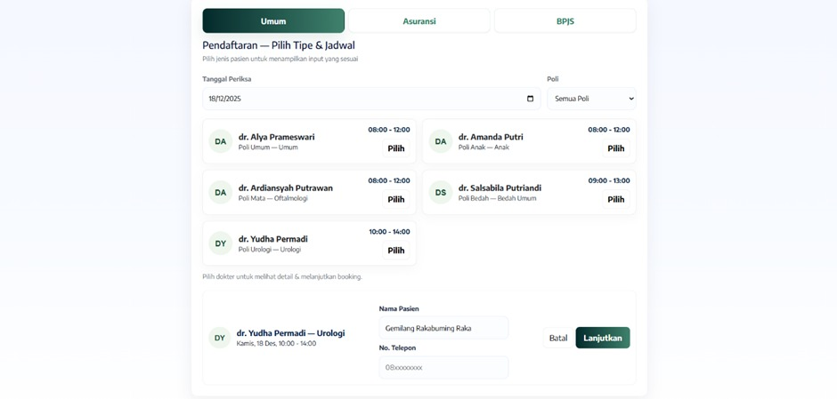
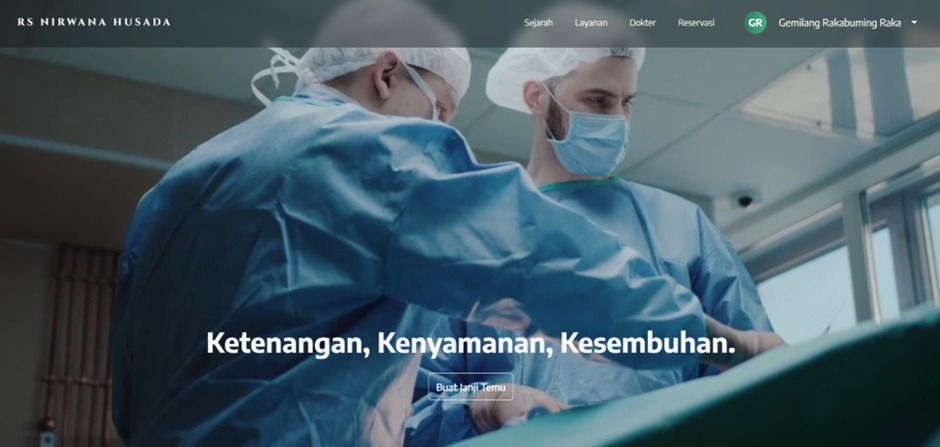
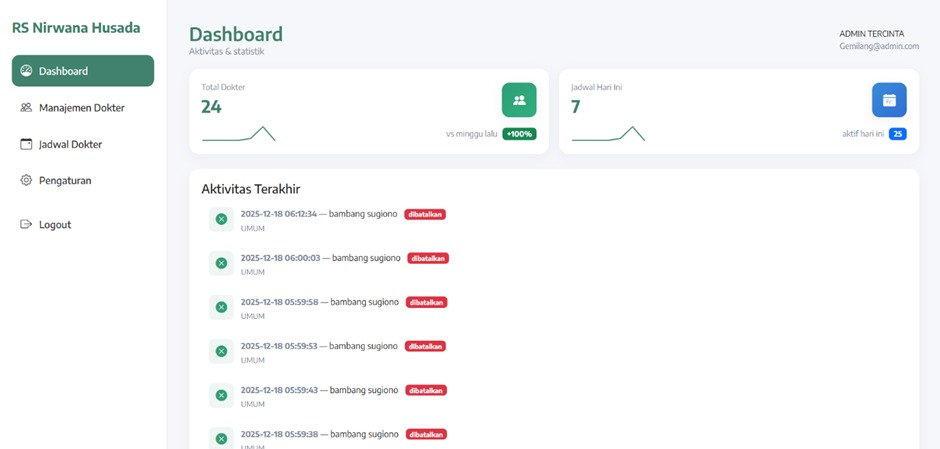
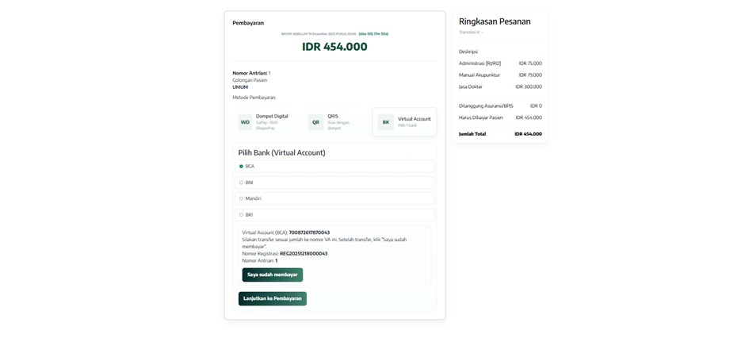
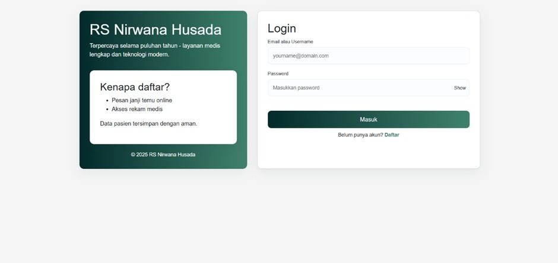

# Rumah-Sakit-Nirwana-Husada
# RumahSakit.com

**Deskripsi singkat**

RumahSakit.com adalah sebuah website sistem informasi rumah sakit untuk pendaftaran pasien, booking jadwal dokter, manajemen profil pasien, serta pembayaran online. Dibangun dengan PHP (struktur file ada di folder `php/`), MySQL (file database ada di `database/`), dan JavaScript/CSS untuk antarmuka.

**Fitur-fitur utama**
*pasien*
- Pendaftaran dan login pengguna (pemeriksaan/verifikasi ID).
- Booking jadwal dokter
- History, Cancel  
- Pembayaran dengan midtrans
- Cetak struk

*admin*
- Dashboard admin untuk mengelola data pasien, dokter, booking, dsb
- Konfirmasi sudah bayar olehg pasien
- Ganti Password dan Username

**Cara menjalankan website (setup)**

*SUDAH DIHOSTING*
1. buka nirwanahusada.site

*SERVER LOKAL*
1. jalankan serverlokal apache mysql (Xampp atau Laragon)
2. download semuanya yang ada di repository
3. tinggal buka localhost/(tempat simpan file)

**Screenshot tampilan website**

**Struktur singkat direktori**

- `php/` - file PHP utama & API
- `css/`, `js/`, `Media/` - aset frontend
- `database/` - file SQL
- `migrations/` - skrip migrasi basis data
